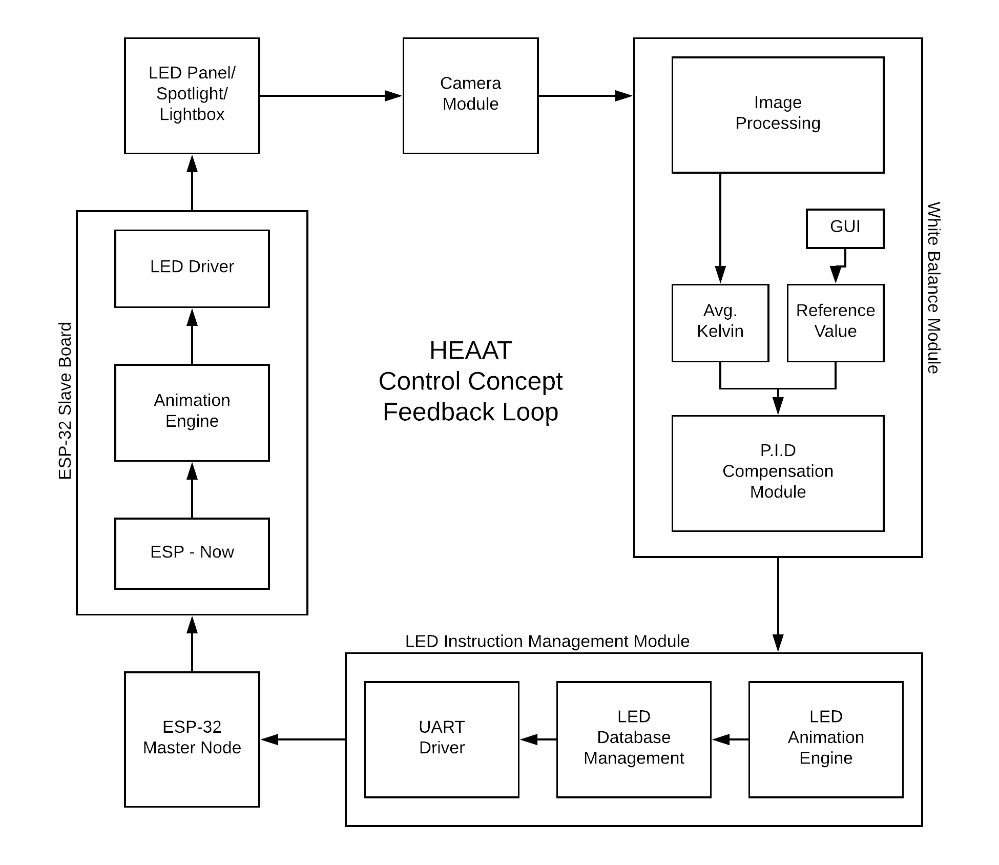

# **Heaat Control Module Application**
Raspberry Pi application for Heaat adaptive lighting. Created by Pranav Reddy, William Redenbaugh, Jacob Nave, Ryan Lau, and Ezra Sarmiento. Tested on Raspberry Pi 3 Model B+ with Adafruit Pi Camera Board v2.

## Heaat Repositories for ESP32
Sorry, these repositories are maintained by my teammates and are not yet available.

## What is it?
Heaat is an adaptive lighting system that outputs a specified color or color temperature of light while adjusting for the environmental lighting. It is also able to adjust on-the-fly for dynamic lighting environments. This repository contains the scripts for the control module, which determines color temperatures from an input and outputs calculated output color temperatures.

## How does it work?
Heaat consists of a control module and several modular lighting elements. The control module consists of a Raspberry Pi 3, a Raspberry Pi Camera, and a ESP32 microcontroller and communicates with lighting elements over the ESP-NOW WIFI protocol. Lighting elements consist of a power supply, customizable led lighting, and another ESP32 microcontroller. Users can connect multiple lighting elements with no degradation in performance.

The control module reads the lighting environment with a Raspberry Pi Camera that has had automatic white balancing disabled. The module then calculates the correlated color temperature of the current environment and uses that value to calculate the output color such that the input image will have the specified target temperature. It then sends that information to any number of Heaat lighting elements using the ESP-NOW protocol and the elements adjust their light color and intensity. The process then repeats using a PID control structure to continuously update the color of the lighting.

### Control structure

## What does it look like?
Before Heaat              |  After Heaat (Target K = 8000)
:-------------------------:|:-------------------------:
  |  

## What hardware is required?
* Raspberry Pi 3 Model B+
* Adafruit Pi Camera Board v2
* Minimum 2x ESP32 Microcontrollers (one (or more) for the lighting element(s) and one for the Raspberry Pi)
* Lighting Element(s) → Can assemble custom lighting element with the following:
    * Choice of LED Lighting
    * ESP32 Microcontroller
    * Power Supply

## License
MIT
